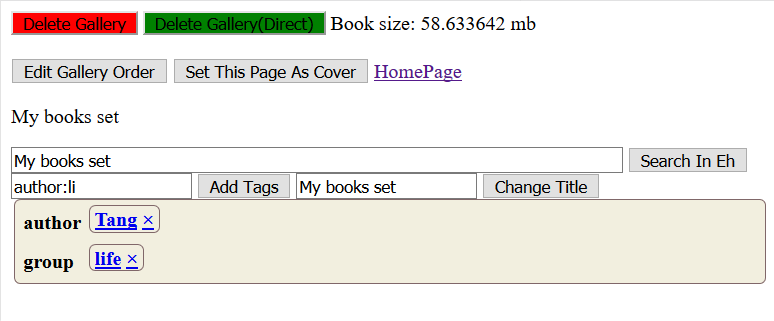
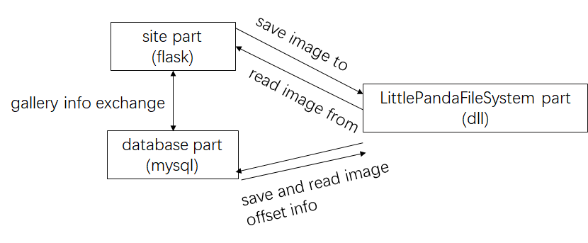
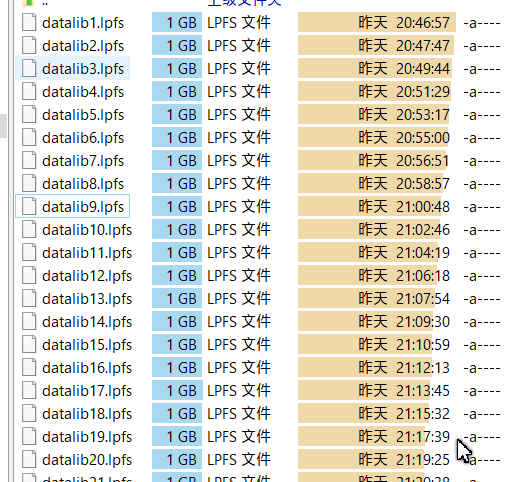

LittlePanda
===============


A local gallery view and manage system written by flask.

下のように、簡単なギャラリー管理システムです。tag 、検索などの機能を提供しています。



また、ウェイブアプリの形でサービスを提供していますので、携帯、タブレット、パソコンなどの端末からも利用できます

> このプロジェクトは大体半年前ウェイブアプリを勉強し始めた時に作ったものです。現在の視点から見ると不足な点もたくさんあり、一旦開発休止中です

# requirements
> * python3
> * flask
> * cython
> * mysqlclient
> * zipfile
> * rarfile
> * PIL

# システムの仕組み
このシステムは下のように

* *site part* (flask)
* *database part* (mysql)
* *LittlePandaFileSystem part*　

で構成されています。画像ファイルの保存システムの説明は下の    *LittlePandaFileSystem* をご覧ください。

# 実行
1. まずは必要なパスを設定します
    ```python
    # littlepandafilesystem lib file path
    LPFS_LIB_PATH = c_wchar_p(r"E:\LPFS_LIB")
    # tmp path to store images
    image_lib_path = c_wchar_p(r"E:\Project\LittlePanda\img")
    # cache for littlepandafilesystem
    exact_path = c_wchar_p(r"E:\LPFS_LIB\cache")
    # tmp path to store images
    tmp_path = c_wchar_p(r"E:\Project\LittlePanda\tmp")
    # the little panda system dll file path
    lpfs_dll = cdll.LoadLibrary(r"E:\Project\LittlePandaFileSystem\x64\Release\LPFS_DLL.dll")
    ```
2. littlepandafilesystemのdllファイルは、[LittlePandaFS repo](https://github.com/tanghaowen/LittlePandaFileSystem) のコードからcompileしてください

3. 最後に
    ```bash
    python flaskSite.py
    ```
    でサイトを実行します。サイトのurlは *127.0.0.1:5000* です。

    個人のギャラリー管理システムですので、*nginx* *uwsgi*　などを使う必要もありません。


# *LittlePandaFileSystem*　に関して

1. 開発の最初、ギャラリーの画像ファイルをそのままハードディスクの *D:\\\\image* フォルダー に保存していました。しかし、*image* フォルダー下の画像が千枚以上越えたら、ファイルの read と wirte スピードが遅くなりました。遅くなった原因は一つのフォルダーの下に、ファイル数が多すぎです。

2. その後、フォルダー下の画像枚数を低減させるため、ファイルの *md5* 値を計算し、*ac/bd/3498d90d812310934.png* の形でファイルを保存していました。

3. この方法は有効でしたが、保存された画像の枚数が何万何十万枚以上超えたら、小さいファイルが大量に存在しているため、ハードディスク全体のread writeが遅くなりました。本来なら、ここで*GFS* *HDFS* などのファイルシステムを使うべきだが、こんな簡単なウェイブアプリにそんな複雑なシステムを導入するには、牛刀もて鶏を割くと思います。

4. そのため、最後に簡単なファイルシステムを作ると決めました。そして、ファイル読み込みの効率を考えた上で、このファイルシステムを*C*言語で作りました。そのファイルシステムは　*LittlePandaFileSystem* です。
   複数の画像ファイルを下のように、1GBごとに、一つのファイルにまとめます。ファイルのoffset情報はそのままmysqlに保存されます

    


詳しいコードは [LittlePandaFS repo](https://github.com/tanghaowen/LittlePandaFileSystem) をご覧ください。


# これから

現在の視点から見ると、このプロジェクトの一番失敗したところは、ファイルシステムを *dll* として開発しました。
python 環境から *dll* 機能を導入し、実行するには想像以上面倒でした。また、c言語とpyhon両方使いましたから、 *dll* の *debug* はとても困難でした（debug手段はほぼprintfしかありませんから）。

最初からファイルシステムもサイトと同じ、ウェイブアプリとして作るの方がいいと思います。ファイルの読み込むと保存は全部ウェイAPIで行うのは多分一番便利だと思います

そして、mysql連携の方は、直接にsqlのコマンドを実行しました。flaskのORMを使いませんでした。